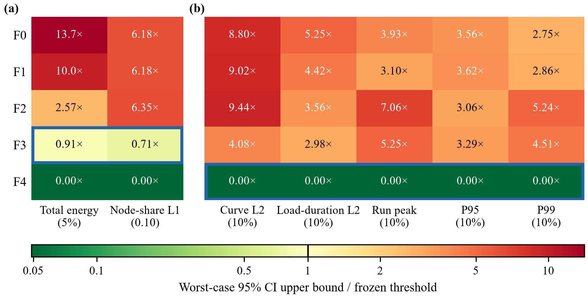

# 面向输出的运行保真度：垂直起降场内生充电负荷模型的嵌套审计

胡楚铭

*拟投稿：Transportation Research Part C: Emerging Technologies（中文工作稿）*

## 亮点

- 五层嵌套运行模型分别隔离乘客成批、有限机队、荷电状态可行性与有限充电桩竞争。
- 在预先冻结的 5% 能量门限和 10% 功率门限下，F3 足以用于能量规划，时间分辨功率分析必须使用 F4。
- 高需求与充电资源紧张同时出现时，模型保真度误差最大。
- 逐次运行峰值比平均负荷曲线峰值高 340–641 kW，先平均后取峰会低估容量暴露。

## 摘要

城市空中交通研究正在越来越多地耦合乘客需求、航空器运行、电池状态与充电资源，但模型精细度往往按经验选择，而不是由具体输出要求决定。本文提出一套嵌套模型审计方法，用于在内生垂直起降场充电负荷模型中选择运行细节。模型为 1 分钟分辨率随机仿真，包含 4 个需求区垂直起降场和 1 个机场垂直起降场，并设置五层嵌套表征：F0 乘客—能量直接换算、F1 队列触发航班生成、F2 有限机队周转、F3 连续荷电状态可行性、F4 有限物理充电桩。所有模型共享同一组随机输入，并以预先冻结的误差容限和配对 95% 置信区间上端进行比较。在四个锚点情景中，F3 通过能量规划判据：总电量误差置信区间上端为 0.000%–4.539%，节点电量份额 L1 距离为 0.0095–0.0706。F2 两项判据均未通过，说明荷电状态、安全储备与任务可行性机制不能从能量规划模型中删除。所有简化层均未通过功率轨迹判据；F3 的曲线 L2 误差为 16.14%–40.75%，高需求紧充电情景下峰值误差达到 52.50%。因此，峰值、尾部功率和时间分辨负荷分析的最低充分层为 F4。最低充分保真度取决于输出目标，而不是模型层级本身的性质。

**关键词**：城市空中交通；eVTOL；垂直起降场充电；内生负荷；运行保真度；荷电状态；模型聚合

## 1. 引言

垂直起降场充电需求由运行过程产生。乘客到达必须聚合成可服务批次，航空器必须出现在正确节点并保有足够荷电状态，充电规则必须触发，物理充电桩必须空闲。这些耦合状态共同决定功率在何时、何地被取用。仅由乘客人数或航班能耗直接生成的负荷曲线，可能在保留总电量的同时把功率放在错误时间，从而影响基础设施容量与电网接入评估。

因此，模型选择问题不是“哪个表征在一般意义上最真实”，而是“针对某一输出，需要保留哪些机制”。总电量、节点电量份额、峰值功率、尾部功率、爬坡率和分钟级负荷轨迹是不同的规划对象。能量规划可以接受较粗的运行细节，而容量评估和电网分析需要物理并发与排队。

已有城市空中交通研究已经将运行与充电耦合起来。基于任务的充电需求研究从航班计划、路径和荷电状态相关充电行为估计场站负荷 [1]；综合仿真平台同时表示乘客处理、航空器状态、能量与充电 [2,3]；电力系统研究将调度和充电窗口接入电网优化 [4]。这些工作证明运行耦合具有重要意义，但尚未形成一套系统的程序，用于判断特定输出下需要多少耦合。

电动汽车聚合研究表明，简化表征可能对部分输出足够准确，对另一部分输出产生较大误差 [5,6]。垂直起降场充电负荷也存在同样问题，但已有城市空中交通充电文献还缺少等价的运行保真度审计。本文针对这一缺口开展嵌套模型实验，提出预先注册的协议，用于识别最低充分运行层，并将该协议应用于机场接驳型垂直起降场网络。

## 2. 相关工作

### 2.1 能量与充电表征

航空器能量模型决定最终需要补充多少能量。电池动力城市航空器在合适任务下具有能效优势，但估计结果对设计、飞行阶段、航程、载荷和备用假设敏感 [7]。本文采用从相关证据标定得到的透明降阶任务能量模型，而不是使用某型认证航空器参数。载客飞行与空机飞行采用不同的线性能量—距离关系，并保留一个低能量映射作为边界情景。

充电需求研究把任务能量和时刻表转化为场站负荷。Taye 等 [1] 表明，航班计划、荷电状态相关充电、航程距离和场站位置会影响能量与功率需求。但当航班预先给定时，随机排队和航空器周转造成的波动有一部分被固定在模型上游。本文将航班生成处理为乘客积累与等待的内生响应。

### 2.2 城市空中交通运行与电力系统的综合研究

系统级研究确立了能量约束、机队管理和基础设施容量在城市空中交通运行中的重要性 [8,9]。微观仿真和综合平台在可比时间尺度上表示乘客服务、航空器移动和能量 [2,3,10]，为内生充电需求提供运行基础。

Wu 等 [4] 将城市空中交通调度与可行充电窗口接入电力系统优化。这是最接近本文的直接先例，也说明“运行、荷电状态和电网耦合”本身不构成本文创新。本文的区别在于：随机队列在运行过程中触发航班，有限充电桩形成无控制的资源竞争，研究问题聚焦表征是否足够，而不是智能充电福利。

### 2.3 模型细节与聚合误差

模型细节选择很少是中性的。在能源系统建模中，增加复杂度并不总是提高准确性 [6,11,12]，简约模型可能足以回答大尺度问题 [13]；建筑能耗仿真中的敏感性研究同样追问哪些简化可以接受 [14]。对电动汽车，有限信息可能保留部分聚合结果，同时使其他结果产生较大误差 [5]。本文将这种面向输出的充分性评估迁移到垂直起降场充电负荷。最详细的测试表征并不被视为真值，而是冻结的机制参照，用于评价更简单的嵌套层。

## 3. 方法

### 3.1 网络与运行边界

网络由 4 个抽象需求区垂直起降场 $D_1$–$D_4$ 和 1 个机场垂直起降场 $A$ 组成。乘客航班只允许从 $D_i$ 到 $A$；空机航班只允许从 $A$ 到 $D_i$，且仅在需求区存在正的触发服务覆盖缺口时发生。机场出发、区间飞行、主动再平衡和窗口后恢复调机均被排除。这一有向结构隔离出机场接驳服务，并显式表示服务所必需的空机返场。

令 $V=\{D_1,D_2,D_3,D_4,A\}$，若 $P_v(t)$ 为节点 $v$ 的电网侧充电功率，则网络功率为

$$P_{\mathrm{net}}(t)=\sum_{v\in V}P_v(t). \tag{1}$$

模型输出是状态依赖映射：

$$P(t)=G\left(\text{到达},\text{队列},\text{航空器状态},\text{SOC},\text{派机规则},\text{充电桩状态}\right). \tag{2}$$

需求是外生的，但充电轨迹是内生的，因为所有中间状态都在仿真中演化。

### 3.2 乘客到达与队列触发航班

网络到达在预热期与正式测量期遵循平稳泊松过程，总到达率为 $\eta\lambda_{\mathrm{ref}}$，每个到达独立分配到需求区 $i$ 的概率为 $\alpha_i$：

$$\lambda_i=\eta\,\alpha_i\,\lambda_{\mathrm{ref}},\qquad \sum_i\alpha_i=1. \tag{3}$$

参考到达率在基准网络上一次标定：

$$\lambda_{\mathrm{ref}}=\rho_{\mathrm{ref}}\frac{60MK}{\bar{\tau}_{\mathrm{cycle}}}, \tag{4}$$

其中 $M$ 为机队规模，$K$ 为座位数，$\bar{\tau}_{\mathrm{cycle}}$ 为加权理想周期时长，$\rho_{\mathrm{ref}}=0.70$ 为参考利用率。乘客按先到先服务排队。当已有 4 名乘客或队首乘客已等待 15 分钟时，触发一个服务批次。触发不保证立即起飞：航空器必须本地可用或从机场返回、高于任务所需荷电状态门槛，并完成周转。

### 3.3 航空器状态与空机返场

每架航空器保留位置、运行状态、剩余活动时间和连续荷电状态。状态包括空闲、乘客周转、载客飞行、机场周转、空机飞行、充电排队和充电。8 架航空器在预热开始时每个需求区 2 架，荷电状态为 0.85，队列为空，充电桩空闲。本地航空器优先分配；机场航空器只派往扣除本地可服务航空器和在途空机后仍存在正覆盖缺口的需求区。

基准巡航距离为 10、12.5、15、17.5 km。单程飞行时间由 4.644 分钟垂直—转换时间加上 241.4 km/h 巡航时间组成；两端周转均为 6 分钟。

### 3.4 飞行能量、电池账本与派飞可行性

本文使用降阶任务能量模型，而非完整气动仿真。对需求区 $i$，载客飞行能量与空机返场能量分别为

$$E_{\mathrm{pax},i}=16.5106+0.43136\,d_i, \tag{5}$$

$$E_{\mathrm{empty},i}=13.4839+0.35229\,d_i, \tag{6}$$

其中 $d_i$ 为水平巡航距离（km），能量单位为 kWh。截距表示与距离无关的垂直和转换阶段，斜率表示巡航能量随距离增长。一个低能量映射被用于边界情景，以检验航空器性能假设敏感性。

电池状态以能量单位连续跟踪。对可用能量 $B=160$ kWh 的航空器 $a$，

$$\mathrm{SOC}_a(t+1)=\mathrm{SOC}_a(t)+\frac{E_{\mathrm{chg},a}(t)-E_{\mathrm{flt},a}(t)}{B}, \tag{7}$$

其中 $E_{\mathrm{chg},a}(t)=\eta_c P_{\mathrm{grid},a}(t)\Delta t$ 为充电桩送入电池的能量，$\eta_c=0.90$，$\Delta t=1/60$ h。派飞前，模型检查航空器完成候选飞行后的荷电状态是否至少为 0.20。该储备约束与 0.50 机会充电触发、0.85 充电目标相互分离。

### 3.5 物理充电桩与节点功率

每个充电桩提供 350 kW 电网侧额定功率。基准机场设置 5 台充电桩，紧资源情景设置 2 台，每个需求区设置 1 台。每次 1 分钟更新内充电不可抢占。若节点所有充电桩被占用，符合条件的航空器获得单调排队序号并先到先服务。节点功率等于活动充电桩功率之和，包含最后一分钟的部分功率。由于需求区充电可能同时发生，网络功率可以超过机场额定容量。

### 3.6 数值时钟与核算边界

内核以 1 分钟步长推进，按固定实现顺序处理活动完成、到达、触发、本地分配、服务必需空机派飞、充电请求、充电桩分配、荷电状态更新和功率核算。模型是基于事件规则的状态转移模型，不是下一事件离散事件仿真。

60 分钟预热期从 $t=-60$ 到 0 分钟运行，状态在 $t=0$ 被继承而不重置。正式窗口为 $t=0$ 到 119 分钟，新到达在 $t=120$ 停止。能量采用固定窗口端点和状态闭合端点两种口径。状态闭合端点继续运行到所有乘客队列清空且所有航空器空闲，受 180 分钟保护上限限制；它闭合服务和航空器活动，但不均衡终端荷电状态。这一区分避免把延迟充电误认为已完成服务能量的减少。

### 3.7 守恒检查与不确定性

四项守恒检查必须满足：乘客账本唯一、完整且不重复；航空器位置与状态总数恒定且状态互斥；每一步机队电池能量变化等于充电获得电池能量减去飞行消耗能量；功率积分等于电网能量，充电占用不超过物理桩数。所有运行必须闭合并通过检查，才能进入统计分析。

每情景使用 30 个共同随机种子。配对差异使用种子级匹配，报告重复均值的双侧 95% 置信区间。表征充分性判断使用配对误差置信区间的上端。这是预先注册的不确定性保护带；通过阈值不被解释为与 F4 统计等价。

## 4. 实验设计

### 4.1 情景矩阵

完整模型采用 10 个情景，改变四个机制维度，而不是遍历全部原始参数。表 1 列出相对基准的变化。

| 编号 | 情景 | 相对基准的变化 | 隔离机制 |
|---|---|---|---|
| M0 | 基准 | 无 | 参考配置 |
| M1 | 低需求 | $\eta=0.75$ | 低运行压力 |
| M2 | 高需求 | $\eta=1.25$ | 接近饱和的运行压力 |
| M3 | 短距离集中 | $\alpha=(0.4,0.3,0.2,0.1)$ | 集中但能量暴露较低 |
| M4 | 长距离集中 | $\alpha=(0.1,0.2,0.3,0.4)$ | 集中且能量暴露较高 |
| M5 | 同质距离 | $d_i=(10,10,10,10)$ km | 消除距离异质性 |
| M6 | 低能量边界 | 替代任务能量映射 | 航空器性能边界 |
| M7 | 紧充电 | 机场充电桩 5 台减为 2 台 | 物理充电桩竞争 |
| M9 | 高需求与紧充电 | M2 + M7 | 需求—资源交互 |
| M10 | 长距离与紧充电 | M4 + M7 | 空间—能量—资源交互 |

### 4.2 嵌套保真度阶梯

保真度实验以 M0、M2、M4、M9 为四个锚点，比较五层嵌套表征：

- **F0 乘客换算**：乘客到达直接换算为充电能量。
- **F1 航班生成**：加入队列、成批和载客飞行，虚拟航空器不受限。
- **F2 有限机队**：加入航空器位置、有限周转和服务必需空机返场，但省略荷电状态与物理充电资源。
- **F3 荷电状态可行性**：加入连续荷电状态、储备、充电触发和不受限充电资源。
- **F4 有限充电桩**：加入物理充电桩数量和充电桩队列。

F4 是冻结的机制参照，不是真值或经过验证的数字孪生。

### 4.3 预先注册的充分性判据

能量规划充分性要求在每个锚点下，总电网电量绝对相对误差的 95% 置信区间上端不超过 5%，节点电量份额 L1 距离不超过 0.10。功率轨迹充分性额外要求归一化曲线 L2、负荷持续曲线 L2、逐次峰值、P95 和 P99 的误差置信区间上端均不超过 10%。

对表征 $F\in\{F0,F1,F2,F3\}$ 和锚点 $m$ 中的种子 $s$，能量误差为

$$e_{E,F}^{(m,s)}=\frac{\left|E_F^{(m,s)}-E_{F4}^{(m,s)}\right|}{E_{F4}^{(m,s)}}, \tag{8}$$

节点电量份额 L1 距离为

$$e_{q,F}^{(m,s)}=\sum_v\left|q_{F,v}^{(m,s)}-q_{F4,v}^{(m,s)}\right|. \tag{9}$$

功率曲线误差为

$$e_{P,F}^{(m,s)}=\frac{\left\|\mathbf P_F^{(m,s)}-\mathbf P_{F4}^{(m,s)}\right\|_2}{\left\|\mathbf P_{F4}^{(m,s)}\right\|_2}. \tag{10}$$

将配对 95% 置信区间上端与冻结阈值比较。只有四个锚点全部通过，才能判定该层对相应输出充分；最低通过层即为该输出类别的最低充分表征。

### 4.4 实现与验证

正式实验使用独立于筛查样本的 30 个共同随机种子。全部 300 次完整模型运行和 600 条保真度记录均闭合并通过守恒检查。F3 运行因构造无充电等待，F4 在重放种子上以零误差复现既有正式标量结果。

## 5. 结果

### 5.1 情景机制

10 情景实验识别了塑造内生负荷的机制。相对基准，低需求使实际电网电量下降 19.9%，高需求使其上升 18.0%；高需求同时使平均等待上升 22.7%，最大队列上升 41.3%。因此，充电负荷并不随乘客人数线性变化。

长距离集中相对短距离集中使电网电量上升 4.8%、飞行能量上升 3.9%，而载客航班数基本不变。低能量边界情景的能量效应最大，使实际电网电量下降 46.9%、飞行能量下降 38.4%，说明绝对能量预测仍高度依赖航空器性能假设。

充电资源约束主要重塑时序，而不是改变总任务能量。紧充电使正式窗口逐次峰值点估计相对基准下降 13.5%，但电网电量仅变化 0.1%，飞行能量仅变化 0.4%。高需求紧充电相对高需求使峰值点估计下降 21.2%；长距离紧充电相对长距离使峰值点估计下降 17.8%。点估计表明存在物理并发上限后的时间转移，但相应差分中的差分区间尚不足以声称稳定的非线性交互。

### 5.2 峰值暴露与不同时性

逐次运行峰值与平均负荷曲线峰值是不同对象。10 个情景中，逐次峰值均值与平均曲线峰值之差为 340–641 kW。先对轨迹取平均再取最大值，会显著低估容量暴露。紧充电情景 M7、M9、M10 的机场满桩概率分别为 29.56%、39.86%、32.94%，基准机场满桩概率为 0。这些情景下网络 P95 和 P99 均为 1050 kW，与持续充电桩占满和功率截顶一致，而不是飞行工作量下降。

### 5.3 能量规划保真度

表 2 报告 F3 层的冻结能量判据。F3 在四个锚点均通过两项判据。最紧边界是 M9，总电量误差置信区间上端为 4.539%，接近 5% 阈值。

| 锚点 | F3 总电量误差 CI 上端 | F3 节点份额 L1 CI 上端 | 判定 |
|---|---:|---:|---|
| M0 | 0.000% | 0.0160 | 通过 |
| M2 | 0.386% | 0.0099 | 通过 |
| M4 | 0.010% | 0.0095 | 通过 |
| M9 | 4.539% | 0.0706 | 通过 |

相比之下，F2 未能通过能量规划判据：总电量误差上端为 11.99%–12.86%，节点份额 L1 距离为 0.538–0.635。仅有限机队周转无法确定需要在哪里、补充多少能量；必须保留荷电状态、储备和跨任务能量记忆。

### 5.4 功率轨迹保真度

所有简化层均未在四个锚点全部通过功率轨迹判据。表 3 报告 F3 的误差置信区间上端。

| 锚点 | 曲线 L2 | 持续曲线 L2 | 峰值 | P95 | P99 | 判定 |
|---|---:|---:|---:|---:|---:|---|
| M0 | 17.50% | 13.64% | 14.44% | 6.55% | 13.69% | 未通过 |
| M2 | 16.81% | 12.68% | 14.48% | 10.19% | 12.40% | 未通过 |
| M4 | 16.14% | 9.32% | 9.92% | 9.80% | 11.70% | 未通过 |
| M9 | 40.75% | 29.84% | 52.50% | 32.93% | 45.11% | 未通过 |

M4 有若干指标单独低于 10%，但曲线 L2 和 P99 仍超过阈值，因此不能挑选有利指标把 F3 判为功率充分。M9 误差最大，说明有限充电桩竞争和排队是高需求、资源稀缺条件下形成时序负荷、峰值截顶和尾部功率的必要机制。

图 1　阈值归一化保真度充分性。每个单元格为四锚点中最不利的 95% 置信区间上端与冻结阈值之比；比值不超过 1 表示该判据通过。蓝色边框标记最低充分层：能量规划为 F3，功率轨迹为 F4。

### 5.5 最低充分层

在冻结判据下，**能量规划输出的最低充分层为 F3，功率轨迹输出的最低充分层为 F4**。该结果不是普适排序：荷电状态主要决定需要补充多少能量以及在哪些节点补充；有限充电桩决定何时能够充电、能否并发充电以及峰值如何被截顶。五层模型均被保留，因为每层隔离不同机制；最低充分性只针对具体输出类别定义。

## 6. 讨论

核心发现是最低充分保真度取决于输出。荷电状态可行性和任务可行性规则决定必须补充多少能量、在哪些节点补充；有限充电桩决定何时补充、能否并发补充以及峰值功率如何被截顶。这两组机制不应合并为单一模型质量尺度。

对于需要总充电电量或节点电量份额的能量规划研究，F3 在测试锚点空间内足够。对于容量、峰值和尾部功率研究，必须使用 F4。高需求紧充电的 M9 是关键边界：它产生最大的 F3 功率误差，也产生最接近预先注册阈值的 F3 能量误差。实践者应在选择模型保真度前，报告输出、容限、运行工况和核算端点。

不同时性结果具有直接实践含义。平均负荷曲线适合可视化，但不是容量统计量。逐次运行峰值比平均曲线峰值高 340–641 kW，因此基于平均轨迹的基础设施筛查会低估峰值暴露。容量分析应保留逐次随机峰值，或使用明确规定的上尾统计量。

结果还表明，模型保真度不能替代航空器性能假设的不确定性。低能量边界对总能量的影响大于测试的空间再分配，而成批、荷电状态阈值和充电桩竞争主要塑造时序。基础设施研究应区分能量来源不确定性与运行同步不确定性。

## 7. 局限性

这是一个稳态峰值窗口机制实验，不是运行预测。泊松需求过程未表示日内高峰、预订、取消、多模式接驳或相关 OD 冲击；节点是抽象结构，不代表某个具体城市网络。

1 分钟时钟不解析亚分钟顺序、电瞬态或充电桩控制动态。航空器性能使用线性航路能量关系和固定可用容量；天气、载荷、电池温度、退化、非线性充电和航空器异质性被省略。基础设施被表示为有限同质充电桩，不包含馈线上限、变压器约束、电压或智能充电。

保真度结论依赖冻结阈值、四个锚点情景和一个抽象网络。M9 的 4.539% 能量误差接近 5% 边界，因此不能外推到更强充电稀缺条件而不重新审计。F4 是机制参照，不是经过验证的数字孪生，也不是电气设计优化。

## 8. 结论

本文提出并应用了一套预先注册的嵌套模型审计方法，用于在内生垂直起降场充电负荷模型中选择运行细节。随机到达通过队列触发成批、有限机队周转、服务必需空机返场、荷电状态可行性和有限充电桩竞争转化为功率。共同随机输入、守恒检查和明确误差判据使表征比较可追溯。

在冻结判据下，F3 是四个锚点中能量规划输出的最低充分层，而时间分辨功率、峰值和尾部功率分析需要 F4。高需求与紧充电同时出现时，保真度误差最大。结果支持一条实践规则：运行保真度应与决策输出、容限、运行工况和核算端点联合选择，并在基础设施规模评估中保留逐次峰值。

## 作者贡献

胡楚铭：概念化、方法设计、软件开发、正式分析、论文撰写与可视化。

## 利益冲突声明

作者声明不存在利益冲突。

## 数据与代码可用性

仿真脚本、配置文件、守恒检查和聚合结果可向通讯作者申请获取。复现记录包含种子编号、守恒残差和确定性重放协议。

## 参考文献

1. Taye, A.G., Pradeep, P., Wei, P., Jones, J.C., Bonin, T., Eberle, D., 2024. Energy demand analysis for eVTOL charging stations in urban air mobility. AIAA AVIATION FORUM AND ASCEND 2024. https://doi.org/10.2514/6.2024-4627
2. Onat, E.B., Bulusu, V., Chakrabarty, A., Hansen, M., Sengupta, R., Sridhar, B., 2024. Evaluating eVTOL network performance and fleet dynamics through simulation-based analysis. AIAA SCITECH 2024 Forum. https://doi.org/10.2514/6.2024-0336
3. Li, B., Zhang, Y., 2026. AAMSim: a comprehensive simulator for advanced air mobility operations and planning. Transportation Research Part C: Emerging Technologies, in press, 105858. https://doi.org/10.1016/j.trc.2026.105858
4. Wu, J., Cao, S., Hansen, M., González, M.C., 2025. Integrating urban air mobility into the power grid through smart charging solutions. Transportation Research Part C: Emerging Technologies 179, 105281. https://doi.org/10.1016/j.trc.2025.105281
5. Cheilas, D., Bindner, H.W., Weckesser, T., 2025. Impact of limited information on estimating aggregated electric vehicle loading: A distribution system operator perspective. Sustainable Energy, Grids and Networks 44, 102012. https://doi.org/10.1016/j.segan.2025.102012
6. Priesmann, J., Nolting, L., Praktiknjo, A., 2019. Are complex energy system models more accurate? An intra-model comparison of power system optimization models. Applied Energy 255, 113783. https://doi.org/10.1016/j.apenergy.2019.113783
7. Sripad, S., Viswanathan, V., 2021. The promise of energy-efficient battery-powered urban aircraft. Proceedings of the National Academy of Sciences 118, e2111164118. https://doi.org/10.1073/pnas.2111164118
8. Kohlman, L.W., Patterson, M.D., 2018. System-level urban air mobility transportation modeling and determination of energy-related constraints. 2018 Aviation Technology, Integration, and Operations Conference. https://doi.org/10.2514/6.2018-3677
9. Li, S., Egorov, M., Kochenderfer, M.J., 2020. Analysis of fleet management and infrastructure constraints in on-demand urban air mobility operations. AIAA AVIATION 2020 Forum. https://doi.org/10.2514/6.2020-2907
10. Naser, F., Peinecke, N., Schuchardt, B.I., 2021. Air taxis vs. taxicabs: a simulation study on the efficiency of UAM. AIAA AVIATION 2021 Forum. https://doi.org/10.2514/6.2021-3202
11. Wirtz, M., Hahn, M., Schreiber, T., Müller, D., 2021. Design optimization of multi-energy systems using mixed-integer linear programming: Which model complexity and level of detail is sufficient? Energy Conversion and Management 240, 114249. https://doi.org/10.1016/j.enconman.2021.114249
12. Gils, H.C., Gardian, H., Kittel, M., et al., 2022. Modeling flexibility in energy systems—comparison of power sector models based on simplified test cases. Renewable and Sustainable Energy Reviews 158, 111995. https://doi.org/10.1016/j.rser.2021.111995
13. Daganzo, C.F., Gayah, V.V., Gonzales, E.J., 2012. The potential of parsimonious models for understanding large scale transportation systems and answering big picture questions. EURO Journal on Transportation and Logistics 1, 47–65. https://doi.org/10.1007/s13676-012-0003-z
14. Peinturier, L., Wallom, D., 2025. Building energy simulation calibration accuracy and modelling complexity: Implications for energy performance improvement. Energy and Buildings, 115971. https://doi.org/10.1016/j.enbuild.2025.115971
