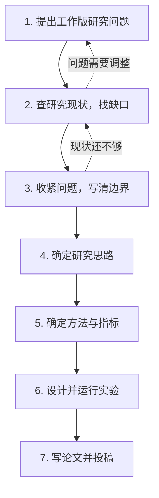

# 研究流程：从问题到论文

## 一句话版

先有工作版问题，再查现状找缺口，再收紧问题，然后定思路和方法，最后做实验、写论文。

## 流程图

## 每一步在做什么

- 1. 工作版问题：先写一句“我想解释什么、回答什么”。不用完美，有方向就行。
- 2. 研究现状：带着问题看别人做到哪一步，重点是找“缺口”。
- 3. 收紧问题：把问题改具体、写边界，让它可证伪、可回答。
- 4. 研究思路：想清楚“用什么逻辑回答这个问题”。
- 5. 方法与指标：选定模型、数据、指标和判定标准。
- 6. 实验：设计情景、随机种子、对照和检验，再运行。
- 7. 写作投稿：按证据写，查引用，再投。