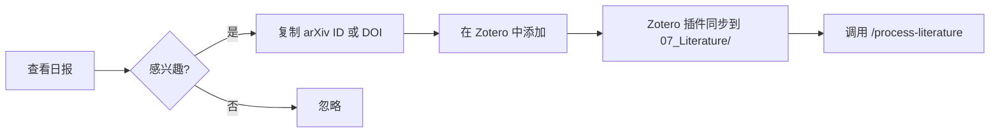

# 论文追踪系统使用指南

> **自动化追踪 arXiv, Semantic Scholar, Google Scholar 等多源学术论文**
> 
> 最后更新：2026-09-10

---

## 📋 目录

1. [系统架构](#系统架构)
2. [快速开始](#快速开始)
3. [配置说明](#配置说明)
4. [日常使用](#日常使用)
5. [自动化设置](#自动化设置)
6. [进阶配置](#进阶配置)
7. [常见问题](#常见问题)

---

## 系统架构

```
_tools/
├── paper_tracker_config.yaml   # 配置文件（关键词、数据源等）
├── paper_tracker.py            # 主追踪脚本
├── paper_tracker_results.json  # 原始数据输出
├── requirements.txt            # Python 依赖
└── README.md                   # 本文档

输出位置：
├── 00_Inbox/待处理/            # 每日 Markdown 汇总
└── 07_Literature/              # Zotero 导入的文献（手动）
```

**工作流程**：
1. 脚本每日自动运行（或手动触发）
2. 查询 arXiv + Semantic Scholar API
3. 生成 Markdown 日报 → `00_Inbox/待处理/`
4. 用户浏览日报，标记感兴趣的论文
5. 手动下载 PDF 到 Zotero → 自动同步到 `07_Literature/`
6. 调用 `/process-literature` 处理重点文献

---

## 快速开始

### 步骤 1：安装依赖

在项目根目录运行：

```bash
cd 04_Projects/城市低空资源研究/_tools

# 使用 uv 安装（推荐）
uv pip install arxiv scholarly requests pyyaml

# 或使用 pip
pip install arxiv scholarly requests pyyaml
```

### 步骤 2：首次运行

```bash
python paper_tracker.py
```

**预期输出**：
```
============================================================
🚀 论文追踪系统启动
============================================================
✅ 配置加载成功: 17 个关键词

🔍 正在搜索 arXiv...
   找到 8 篇相关论文

🔍 正在搜索 Semantic Scholar...
   找到 12 篇相关论文

✅ 原始数据已保存: paper_tracker_results.json
✅ Markdown 日报已保存: ../../00_Inbox/待处理/2026-09-10-论文追踪日报.md

============================================================
✨ 追踪完成！共发现 20 篇论文
============================================================
```

### 步骤 3：查看日报

打开 `00_Inbox/待处理/YYYY-MM-DD-论文追踪日报.md`，浏览推送的论文。

---

## 配置说明

### 核心配置文件：`paper_tracker_config.yaml`

#### 1. 关键词管理

```yaml
keywords:
  chinese:
    - 城市空中交通
    - eVTOL运行系统
    # ... 更多关键词
  
  english:
    - Urban Air Mobility
    - eVTOL
    # ... 更多关键词
```

**修改建议**：
- 定期审查关键词，删除无关术语
- 添加新发现的专业术语
- 中文关键词暂时未启用（Google Scholar 支持受限）

#### 2. arXiv 类别

```yaml
arxiv_categories:
  - cs.RO   # Robotics
  - eess.SY # Systems and Control
  - cs.MA   # Multiagent Systems
```

**说明**：目前按关键词查询，不限定类别。如需严格过滤，可在脚本中启用类别筛选。

#### 3. 输出设置

```yaml
output:
  max_results_per_source: 20   # 每个数据源最多返回 N 篇
  days_lookback: 7             # 查询最近 N 天的论文
```

**调整建议**：
- 活跃领域：`days_lookback: 3-5`
- 稳定领域：`days_lookback: 14`

---

## 日常使用

### 手动运行（推荐初期使用）

```bash
cd 04_Projects/城市低空资源研究/_tools
python paper_tracker.py
```

### 查看输出

1. **Markdown 日报**（适合快速浏览）：
   - 位置：`00_Inbox/待处理/YYYY-MM-DD-论文追踪日报.md`
   - 包含标题、作者、摘要前 300 字、下载链接

2. **JSON 原始数据**（适合程序化处理）：
   - 位置：`_tools/paper_tracker_results.json`
   - 完整论文元数据

### 后续处理流程



---

## 自动化设置

### Windows 任务计划程序

#### 创建每日任务

1. 打开"任务计划程序"（`taskschd.msc`）

2. 创建基本任务：
   - **名称**：论文追踪 - 每日运行
   - **触发器**：每天上午 9:00
   - **操作**：启动程序
     - 程序：`python`
     - 参数：`paper_tracker.py`
     - 起始于：`D:\claude\hcmingGo\hcmingGo\04_Projects\城市低空资源研究\_tools`

3. 高级设置：
   - ✅ 如果任务失败，每 1 小时重试一次
   - ✅ 最多重试 3 次

#### 脚本方式（PowerShell）

```powershell
# 创建任务
$action = New-ScheduledTaskAction -Execute "python" `
  -Argument "paper_tracker.py" `
  -WorkingDirectory "D:\claude\hcmingGo\hcmingGo\04_Projects\城市低空资源研究\_tools"

$trigger = New-ScheduledTaskTrigger -Daily -At 9:00AM

Register-ScheduledTask -TaskName "论文追踪-每日运行" `
  -Action $action `
  -Trigger $trigger `
  -Description "自动追踪 UAM 相关最新论文"
```

---

## 进阶配置

### 1. Google Scholar Alerts（补充追踪）

**手动设置步骤**：

1. 访问 [Google Scholar](https://scholar.google.com/)
2. 搜索关键词组合：
   ```
   "Urban Air Mobility" OR "eVTOL" OR "Vertiport"
   ```
3. 点击左下角 **"创建快讯"**
4. 设置：
   - 频率：每日
   - 接收方式：邮件
5. 在邮件中点击论文链接，手动添加到 Zotero

**优势**：Google Scholar 覆盖范围最广，包含会议论文、期刊、专利等。

### 2. Zotero RSS 订阅（期刊最新目录）

#### 推荐期刊

| 期刊名称 | RSS 订阅方式 |
|---------|-------------|
| **Transportation Research Part C** | Elsevier 官网 → RSS feed |
| **IEEE Trans. on ITS** | IEEE Xplore → Create Alert → RSS |
| **Applied Energy** | Elsevier 官网 → RSS feed |
| **Energy** | Elsevier 官网 → RSS feed |

#### 在 Zotero 中订阅

1. 打开 Zotero → **文件** → **新建订阅**
2. 输入期刊 RSS URL
3. 新文章会自动出现在 Zotero 的"订阅"文件夹
4. 右键感兴趣的文章 → **添加到我的文库**

### 3. 扩展关键词策略

#### 使用布尔逻辑

编辑 `paper_tracker.py` 中的 `build_arxiv_query()` 方法：

```python
def build_arxiv_query(self) -> str:
    # 精确匹配策略
    core = '("Urban Air Mobility" OR "eVTOL")'
    
    # 排除无关领域
    exclude = 'ANDNOT (medicine OR biology)'
    
    # 时间限制（arXiv API 不直接支持，需后处理）
    return f'{core} {exclude}'
```

#### 添加引用网络追踪

在 `search_semantic_scholar()` 中添加：

```python
# 追踪特定论文的引用
seed_papers = ["DOI:10.xxxx/xxxxx"]  # 领域内经典论文
for doi in seed_papers:
    citations = get_paper_citations(doi)  # 需实现此函数
    papers.extend(citations)
```

---

## 常见问题

### Q1: 运行脚本时提示 `ModuleNotFoundError: No module named 'arxiv'`

**解决**：
```bash
uv pip install arxiv scholarly requests pyyaml
```

### Q2: Semantic Scholar API 返回 429 错误（请求过多）

**原因**：API 限速（100 req/5min）

**解决**：
1. 脚本已内置 1 秒延迟
2. 减少 `max_results_per_source` 配置
3. 申请 [Semantic Scholar API Key](https://www.semanticscholar.org/product/api)（可提升限额）

### Q3: 如何过滤掉已读过的论文？

**方案 1**：维护已读列表
```python
# 在配置文件中添加
processed_papers:
  - "arXiv:2301.12345"
  - "DOI:10.1234/abcd"
```

**方案 2**：与 Zotero 数据库联动（高级）
- 读取 Zotero SQLite 数据库
- 过滤掉已在库中的论文

### Q4: 想追踪特定作者的最新工作

编辑 `paper_tracker_config.yaml`：
```yaml
# 新增作者追踪
authors_to_follow:
  - "Kaushik Roy"
  - "Sebastian Scherer"
```

然后在脚本中实现作者过滤逻辑。

### Q5: 日报太长，如何只看高相关度论文？

**修改相关度评分**（需自行实现）：
```python
def calculate_relevance_score(paper: Dict) -> float:
    """基于标题+摘要中的关键词密度打分"""
    score = 0
    text = (paper['title'] + ' ' + paper['abstract']).lower()
    
    for keyword in HIGH_PRIORITY_KEYWORDS:
        if keyword.lower() in text:
            score += 2
    
    return score

# 过滤 score >= 5 的论文
```

---

## 技术支持

**问题反馈**：
- 在 Obsidian 中调用 `/help` 咨询 Claude
- 查看脚本输出的错误日志
- 检查 `paper_tracker_results.json` 是否生成

**性能优化**：
- 当前配置：每次运行约 30-60 秒
- 瓶颈：API 请求延迟
- 优化方向：并发请求、本地缓存

---

## 附录

### A. 依赖清单（requirements.txt）

```txt
arxiv>=2.0.0
scholarly>=1.7.0
requests>=2.31.0
PyYAML>=6.0
```

### B. 数据源对比

| 数据源 | 覆盖范围 | 更新速度 | API 限制 | 推荐场景 |
|-------|---------|---------|---------|---------|
| **arXiv** | 预印本 | 实时 | 3 req/s | 追踪最新研究 |
| **Semantic Scholar** | 全学科论文 | 周更新 | 100 req/5min | 发现相关工作 |
| **Google Scholar** | 全网学术资源 | 实时 | 需手动 | 全面覆盖 |
| **期刊 RSS** | 特定期刊 | 期刊发布 | 无限制 | 顶会顶刊追踪 |

### C. 关键词优化建议

**当前关键词分析**：
- ✅ 高精度：Urban Air Mobility, eVTOL, Vertiport
- ⚠️  可能过宽：Simulation-Optimization（需结合领域）
- 💡 建议添加：
  - `vertiport network design`
  - `UAM demand modeling`
  - `air taxi scheduling`

**定期审查**（每月）：
1. 检查日报中的误报率
2. 记录高价值论文的关键词
3. 迭代更新配置文件

---

*最后更新：2026-09-10 | 维护者：Claude Scholar*
