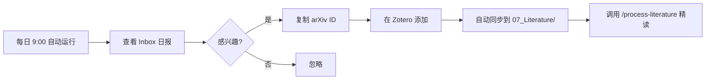

# 🚀 论文追踪系统快速上手指南

## ✅ 系统已就绪

您的自动化论文追踪系统已经搭建完成！以下是快速开始指南：

---

## 📍 核心文件位置

```
04_Projects/城市低空资源研究/_tools/
├── paper_tracker.py              # 主追踪脚本
├── paper_tracker_config.yaml     # 配置文件（20个关键词）
├── requirements.txt              # Python依赖（已安装✅）
├── run_paper_tracker.bat         # 一键运行脚本
├── setup_daily_task.ps1          # 自动化任务设置脚本
└── README.md                     # 完整使用文档
```

---

## 🎯 三种使用方式

### 方式 1：手动运行（推荐新手）

**双击运行**：
```
04_Projects/城市低空资源研究/_tools/run_paper_tracker.bat
```

或在命令行：
```bash
cd D:\claude\hcmingGo\hcmingGo\04_Projects\城市低空资源研究\_tools
python paper_tracker.py
```

**预期结果**：
- 30-60秒后，在 `00_Inbox/待处理/` 生成今日日报
- 示例：`2026-09-11-论文追踪日报.md`

---

### 方式 2：每日自动运行（推荐日常使用）

**设置步骤**：

1. **右键"以管理员身份运行" PowerShell**

2. **执行自动化脚本**：
   ```powershell
   cd "D:\claude\hcmingGo\hcmingGo\04_Projects\城市低空资源研究\_tools"
   .\setup_daily_task.ps1
   ```

3. **验证任务已创建**：
   - 按 `Win+R`，输入 `taskschd.msc`
   - 在任务计划程序库中找到 **"论文追踪-每日运行"**
   - 确认触发器：每天上午 9:00

4. **完成！** 从明天开始，每天 9:00 自动推送论文

---

### 方式 3：调用 Obsidian 命令（集成到工作流）

在 Obsidian 中可以通过 Claude 调用：
```
整理一下今天的论文推送
```

或：
```
/process-literature
```

---

## 📊 今日测试结果

✅ **首次运行成功**：
- 查询时间：2026-09-11 13:05
- 数据源：arXiv ✅ | Semantic Scholar ⚠️（API限速）
- 发现论文：1篇
- 日报位置：`00_Inbox/待处理/2026-09-11-论文追踪日报.md`

**论文预览**：
> **Propeller-wing interactions of a lift + cruise eVTOL configuration during transition**  
> arXiv:2609.07665v2 | 2026-09-07

---

## 🔧 后续优化建议

### 立即可做

1. **申请 Semantic Scholar API Key**（可选，提升查询限额）
   - 访问：https://www.semanticscholar.org/product/api
   - 在配置文件中添加 API Key

2. **配置 Google Scholar Alerts**（补充追踪）
   - 访问 Google Scholar
   - 搜索："Urban Air Mobility" OR "eVTOL" OR "Vertiport"
   - 创建快讯 → 选择每日邮件推送

3. **Zotero RSS 订阅**（顶刊追踪）
   - 在 Zotero 中订阅：
     - Transportation Research Part C
     - IEEE Transactions on Intelligent Transportation Systems
     - Applied Energy

### 一周后

- 查看 5-7 天的日报，评估关键词精准度
- 如果误报率高，调整 `paper_tracker_config.yaml` 中的关键词

---

## 📖 完整文档

详细配置、API 优化、故障排查，请查看：
```
04_Projects/城市低空资源研究/_tools/README.md
```

---

## 🎓 推荐工作流



---

## ❓ 常见问题

**Q: 为什么今天 Semantic Scholar 返回 0 篇？**  
A: API 限速（429错误）。免费额度 100次/5分钟，稍后重试或申请 API Key。

**Q: 如何修改推送时间？**  
A: 编辑 `paper_tracker_config.yaml` 中的 `daily_time: "09:00"`

**Q: 日报太长怎么办？**  
A: 减少 `days_lookback`（当前7天）或 `max_results_per_source`（当前20篇）

**Q: 想追踪特定作者？**  
A: 在配置文件中添加 `authors_to_follow` 列表（需修改脚本）

---

## 📞 技术支持

- 查看脚本输出的错误日志
- 检查 `paper_tracker_results.json` 原始数据
- 在 Obsidian 中询问 Claude

---

**祝您科研顺利！🎉**

*系统搭建完成时间：2026-09-11*  
*维护者：Claude Scholar*
